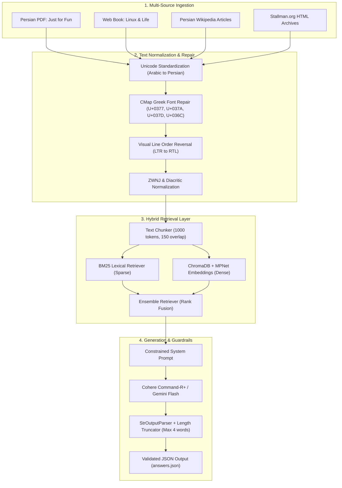

[](https://github.com/a-abedin/librechat-persian-rag/actions/workflows/ci.yml)

# LibreChat: Persian Domain-Specific RAG Pipeline

> **Capstone Project:** Applied LLM Applications & Domain-Specific Retrieval-Augmented Generation (RAG)

LibreChat is an end-to-end question-answering pipeline developed with **LangChain**, tailored to extract precise, grounded, and concise information regarding the history, philosophy, and prominent figures of Linux and the Free Software movement (Linus Torvalds, Richard Stallman, and the FSF).

The pipeline ingests heterogeneous corpora—including digitized Persian PDF books, live web content, Persian Wikipedia articles, and scraped web archives—and utilizes a **Hybrid Retrieval** architecture (Dense Semantic Vector Search + BM25 Lexical Keyword Matching) coupled with strict output guardrails for automated arbitration.

---

## 🏗️ System Architecture



---

## 🌟 Key Engineering Challenges Solved

### 1. Persian PDF Font Normalization (CMap Glitches)
Digitized Persian PDF extraction via low-level renderers (such as PyPDFium2) frequently yields severe font artifacts due to non-standard font mapping tables:
* **Greek/Latin Substitution:** Persian characters mapped to unrelated Unicode code points (e.g., `ͷ` for final *Kaf*, `ͺ` for medial *Kaf*, `ͽ` for *Gaf*, and `ͬ` for *Yeh*).
* **Token Disjointment:** Extracted LTR Greek glyphs disrupt surrounding RTL sentences, forcing the engine to place punctuation and suffixes at the beginning of tokens.
* **Solution:** Built `PersianTextCleaner` with targeted regex patterns to re-map code points, reconstruct visual lines, and normalize Zero-Width Non-Joiners (ZWNJ).

### 2. Named-Entity Failure & Hybrid Search
Dense multilingual embedding models (`paraphrase-multilingual-mpnet-base-v2`) excel at semantic representations but occasionally overlook exact proper nouns (e.g., distinguishing entity names like *Transmeta* and *Symbolics* from surrounding generic terminology):
* **Solution:** Integrated an `EnsembleRetriever` combining dense vector search (ChromaDB) with sparse lexical matching (`BM25Retriever`), significantly boosting recall for domain-specific terminology.

### 3. Strict Automated Arbitration Guardrails
Automated evaluation platforms reject answers exceeding four words or containing conversational filler:
* Decoupled raw text extraction from dictionary construction, eliminating JSON parser crashes.
* Implemented programmatic length truncation ($\le 4$ words) and rate-limit backoff handling for Cohere/Gemini trial endpoints.

---

## 📁 Repository Structure

```text
librechat-persian-rag/
├── data/
│   ├── justforfun_persian.pdf      # Digitized Persian PDF book
│   └── html/                       # Scraped HTML pages from stallman.org
├── src/
│   ├── __init__.py                 # Package root exposing public modules
│   ├── config.py                   # Centralized configuration dataclass
│   ├── preprocessor.py             # PersianTextCleaner engine
│   ├── loaders.py                  # MultiSourceDataLoader implementation
│   ├── retriever.py                # HybridRetrieverManager (Chroma + BM25)
│   └── rag_engine.py               # Core RAG pipeline with safety guardrails
├── main.py                         # Command-line interface and benchmark runner
├── answers.json                    # Benchmark evaluation results
├── requirements.txt                # Pinned dependencies
├── .gitignore                      # Git exclusion rules
└── README.md                       # Architectural documentation
```

---

## 🚀 Getting Started

### 1. Clone the Repository
```bash
git clone [https://github.com/](https://github.com/)<YOUR_GITHUB_USERNAME>/librechat-persian-rag.git
cd librechat-persian-rag
```

### 2. Environment Setup
```bash
python3 -m venv env
source env/bin/activate
pip install -r requirements.txt
```

### 3. Configure API Credentials
Export your LLM provider API key to your environment:
```bash
export COHERE_API_KEY="your-cohere-api-key"
# or
export GEMINI_API_KEY="your-gemini-api-key"
```

### 4. Execute Benchmark Evaluation
Run the automated benchmark evaluation:
```bash
python main.py --benchmark
```
*Note: On its initial run, the pipeline ingests raw documents in `data/`, computes embeddings, and persists the vector database in `./chroma_librechat_db/` for zero-latency subsequent queries.*

---

## 📊 Benchmark Evaluation Sample

The pipeline was evaluated against a 16-question benchmark assessing entity extraction, fact retrieval, and strict word-count compliance:

```json
[
    {
        "question_number": 1,
        "answer": "ترنسمتا"
    },
    {
        "question_number": 2,
        "answer": "دانشگاه آزاد آمستردام"
    },
    {
        "question_number": 4,
        "answer": "ریچارد استالمن"
    },
    {
        "question_number": 16,
        "answer": "کنجکاوی"
    }
]
```
